# ClimateBERT Base Model — Proof of Concept Report

**Prepared for**: Linguistics Faculty Review  
**Date**: February 2026  
**Model Tested**: ClimateBERT (`distilroberta-base-climate-f`)  
**Dataset**: 37 annotated paragraphs from 3 climate change articles

---

## Table of Contents

1. [Executive Summary](#1-executive-summary)
2. [Background: What Is ClimateBERT?](#2-background-what-is-climatebert)
3. [Key Terminology](#3-key-terminology)
4. [What We Tested](#4-what-we-tested)
5. [Findings](#5-findings)
   - 5.1 Does the model understand climate language?
   - 5.2 Can it distinguish between different frames?
   - 5.3 At what level does frame signal exist?
   - 5.4 How does ClimateBERT compare to a generic model?
   - 5.5 How does the model distribute its attention?
6. [Data Quality Issues Found](#6-data-quality-issues-found)
7. [Data Format Recommendations](#7-data-format-recommendations)
8. [Technical Details for Reference](#8-technical-details)
9. [Conclusions and Next Steps](#9-conclusions-and-next-steps)
10. [Proposed Architecture — Design, Rationale & Handling the Large Label Space](#10-proposed-architecture--design-rationale--handling-the-large-label-space)
    - 10.1 The Core Architectural Challenge
    - 10.2 Head 1 — BIO Token Classifier
    - 10.3 Head 2 — Frame Classification via Dual-Encoder Retrieval
    - 10.4 Head 3 — Contrastive Token Embedding
    - 10.5 Handling 89 Distinct Frames — A Five-Layer Strategy
    - 10.6 Summary of Architectural Recommendations
    - 10.7 Expected Training Regime
    - 10.8 Relationship to Published Work & Novelty Position

---

## 1. Executive Summary

We tested a pre-trained AI language model called **ClimateBERT** to evaluate whether it can serve as the foundation for an automated climate frame classification system. The goal of this system is to:

1. **Take a climate-related paragraph** and predict which cognitive **frames** it evokes (e.g., "Causation", "Melting", "Threat").
2. **Identify specific words and phrases** within the paragraph that trigger each frame.
3. **Group similar frame-evoking language together** for analysis.

### Key Findings at a Glance

| Question | Answer |
|---|---|
| Does ClimateBERT understand climate language? | **Yes** — it reliably predicts semantically appropriate climate terms (see Section 5.1) |
| Can it already separate different frames? | **Partially** — similar frames cluster together, but fine-grained boundaries need training (see Section 5.2) |
| Is it better than a generic language model? | **Yes** — 76% better at separating frame groups than a non-climate model (see Section 5.4) |
| Can it classify frames without training? | **No** — zero-shot accuracy is only 8.1%; a classification component must be added (see Section 5.2) |
| Does it pay attention to frame-evoking words? | **Early layers do, but overall no** — frame tokens form a weak internal network, but the final representation is dominated by punctuation (see Section 5.5) |
| Is the current data format sufficient? | **Mostly** — one critical modification is needed (see Section 7) |

### The Linguistic Perspective
From a computational linguistics standpoint, this POC demonstrates that **cognitive framing is already surfacing in the model's unsupervised logic**. While the model was never taught what a "frame" is, its internal mathematical map already groups climate-specific frame-evoking language into distinct semantic neighborhoods. Our proposed next steps move from **observation** (the base model) to **operationalization** (the fine-tuned model), allowing us to automatically detect the subtle linguistic choices that shape climate discourse.

**Verdict**: ClimateBERT is well-suited as the foundation model. Its climate-specific training gives it strong domain understanding. However, the model needs additional training (called "fine-tuning") on frame-annotated data to perform frame classification. Before that training can begin, the annotation format requires one key adjustment.

---

## 2. Background: What Is ClimateBERT?

**ClimateBERT** is a language model developed by researchers at ETH Zurich and the University of Zurich. It belongs to a family of models called **BERT** (Bidirectional Encoder Representations from Transformers), which are artificial intelligence systems designed to understand the meaning and context of text.

### How It Works (Simplified)

Imagine a linguistics student who has read over **2 million climate-related paragraphs** from research papers, news articles, corporate reports, and policy documents. After this extensive reading, they have developed a strong intuition for climate language — they understand that "retreating glaciers", "shrinking ice caps", and "melting polar regions" all refer to similar phenomena.

ClimateBERT works similarly. It was trained by processing over 2 million climate-related texts, during which it learned:
- Which words frequently appear together in climate contexts
- How climate concepts relate to one another
- The semantic patterns of climate discourse

The specific version we tested (`distilroberta-base-climate-f`) has **82.4 million parameters** — these are the numerical values the model uses to represent its understanding of language. It uses a vocabulary of approximately 50,000 word pieces (see "Subword Tokenization" in Section 3).

### What Is a "Base" Model?

Importantly, this is a **base** model — it has general climate language understanding but has **not** been trained on any specific task. It is analogous to a well-read student who has not yet been given specific instructions on what to look for. Our goal is to assess what this student already understands before we begin specialized training.

---

## 3. Key Terminology

The following technical terms appear throughout this report. Each is explained in accessible language.

| Term | Explanation |
|---|---|
| **Embedding** | A mathematical representation of a word, sentence, or paragraph as a point in space. Imagine placing every paragraph on a map — paragraphs about similar topics should end up close together. Each paragraph is represented by 768 numbers that define its position. |
| **Clustering** | The tendency of similar items to form groups on the map. If paragraphs about "Melting" cluster together and separately from "Energy Transition", the model has learned to distinguish these concepts. |
| **Silhouette Score** | A measure of how well-separated the clusters are, ranging from −1 to +1. A score above 0.5 indicates reasonably distinct groupings. A score near 0 means the groups overlap heavily. |
| **UMAP** | A visualization method that takes the 768-number representation and projects it onto a 2D plot that humans can view. Think of it as taking a 3D globe and flattening it into a 2D map. |
| **Cosine Similarity** | A measure of how similar two representations are. A value of 1.0 means identical; 0.5 means moderately similar; 0.0 means unrelated. |
| **Masked Language Modeling (MLM)** | A fill-in-the-blank test used to probe a model's vocabulary and domain knowledge. Example: "Glaciers are [MASK] at unprecedented rates." |
| **Attention** | The mechanism by which the model assigns weight to different words in a sentence. An "attention head" is a specialized cognitive path that looks for specific patterns (e.g., one head might look for subjects, another for climate verbs). |
| **Attention Rollout** | A method to see the cumulative focus of the model across all layers. It allows us to ask: "By the time the model has finished reading, which words ended up being preserved as most important?" |
| **Entropy (Attention)** | A measure of focus. **Low entropy** means the model is Lasering in on one specific word. **High entropy** means the model is spreading its attention broadly across the whole paragraph. |
| **Gradient Saliency** | A calculation of influence. It tells us: "If I changed this one word, how much would it change the model's final conclusion?" High saliency words are the 'anchors' of meaning. |
| **k-Nearest Neighbor (k-NN)** | A classification method: for each paragraph, find the most similar paragraph in the dataset and predict the same label. |
| **Fine-tuning** | Training a pre-trained model on specific labeled examples (like your 37 paragraphs) to teach it a new skill (like frame classification). |
| **Subword Tokenization** | How the model breaks text into processable units. For example: "extraordinary" → "extra" + "ordinary". This ensures the model never encounters an "unknown" word, as it can build them from familiar parts. |
| **Leave-One-Out (LOO-CV)** | A testing method where we test the model's performance on one example after training it on all others, repeating for every item to ensure the results aren't just a fluke of the data split. |
| **BIO Tagging** | A standard format for labeling words in a sequence: **B**eginning of a term, **I**nside of a term, and **O**utside (everything else). This is the gold standard for "extracting" specific quotes. |

---

## 4. What We Tested

We ran **14 tests across 4 rounds**, each designed to answer a specific question about the base model's capabilities. No frame classification training was performed — these tests measure what the model already understands from its climate language pre-training.

### Test Inventory

| # | Test | Question It Answers |
|---|---|---|
| 1 | Paragraph Embedding UMAP | Do paragraphs with the same frame naturally cluster together? |
| 2 | Token Embedding UMAP | Do frame-evoking words from the same frame cluster together? |
| 3 | Frame Similarity Heatmap | Which frames does the model consider similar to each other? |
| 4 | Masked Language Modeling | Does the model understand climate domain vocabulary? |
| 5 | Attention Analysis | Does the model naturally focus on frame-evoking words? |
| 6 | Zero-Shot Classification | Can the model classify frames without any training? |
| 7 | Intra vs Inter Similarity | Are same-frame paragraphs more similar than different-frame paragraphs? |
| 8 | Frame Taxonomy Analysis | How does the model perceive relationships between all 89 frame labels? |
| 9 | Tokenizer Coverage | How does the model handle multi-word frame expressions? |
| 10 | Layer-wise Analysis | Where in the model does frame knowledge reside? |
| 11 | k-NN Probing Classifier | How well can a simple classifier work on these representations? |
| 12 | Sentence Decomposition | Do individual sentences carry frame signal, or is it paragraph-level? |
| 13 | ClimateBERT vs Generic Model | Is the climate-specific training actually beneficial? |
| 14 | Gradient Saliency | Which words truly matter most to the model's understanding? |
| 15 | Head-level Attention Scores | Which of the 72 attention heads focus on frame-evoking words? |
| 16 | Attention Rollout | After all layers, how much does the model's representation rely on frame tokens? |
| 17 | Per-Paragraph Attention Maps | Visually, where does the model look for each paragraph? |
| 18 | Frame Token Cross-Attention | Do frame-evoking words attend to each other? |
| 19 | Attention Entropy | How focused vs diffuse are different attention heads? |

---

## 5. Findings

### 5.1 Does the Model Understand Climate Language?

**Answer: Yes — demonstrably well.**

#### Fill-in-the-Blank Test (Masked Language Modeling)

We hid key words from climate paragraphs and asked the model to predict what was missing. The results show strong climate domain understanding:

| Hidden Word | Model's Predictions (with confidence) |
|---|---|
| **"melting"** (from a paragraph about glaciers) | melting (66%), **retreating** (9%), **disappearing** (6%), **shrinking** (5%) |
| **"human activities"** (from a causation paragraph) | humans (99%), wildfires, fires |
| **"trapping heat"** (from a greenhouse effect paragraph) | **warming** (25%), **heating** (12%), melting (12%), trapping (9%) |
| **"destructive"** (from a hurricane threat paragraph) | destructive (21%), **intense** (17%), **dangerous** (15%), **frequent** (13%) |
| **"flooding"** (from a sea-level rise paragraph) | **erosion** (16%), damage (9%), collapse (8%), **disasters** (8%) |
| **"shrinking"** (from a glacier paragraph) | **disappearing** (72%), retreating (8%), melting (5%) |

**Interpretation**: When "melting" is hidden, the model predicts "retreating", "disappearing", and "shrinking" — all semantically coherent alternatives in a climate context. This demonstrates that ClimateBERT has internalized the relationships between climate concepts through **distributional semantics**: it knows these words share similar contexts.

From a linguistic perspective, this means the model understands **frame-evoking collocations**. It doesn't just know the word "melting"; it knows that in the frame of "Glacier Retreat", "melting" is functionally interchangeable with "shrinking" or "retreating". This is crucial because it means the model is already "pre-programmed" with the climate-specific vocabulary that linguists use to identify frames.

#### Token Clustering

Beyond full paragraphs, we mapped the 132 frame-evoking tokens onto a 2D space to see how the model organizes individual words:

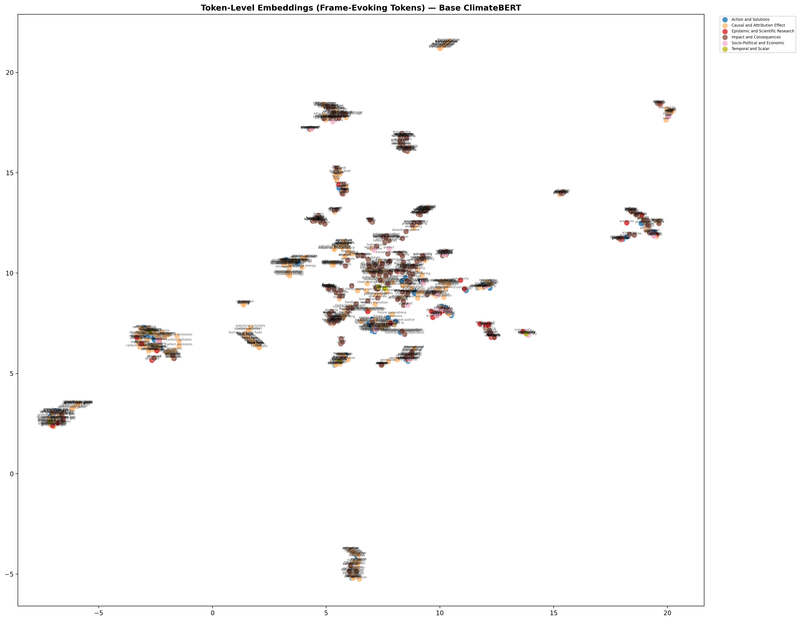

**Linguistic Insight**: Notice that tokens from the same frame (same color) tend to cluster together even without paragraph context. This confirms that the model's understanding of frame-evoking language is **lexical**—it's built into the way it represents the words themselves.

#### Frame Similarity

The following heatmap shows how similar the model considers each pair of frames to be by comparing the average representation of their paragraphs:

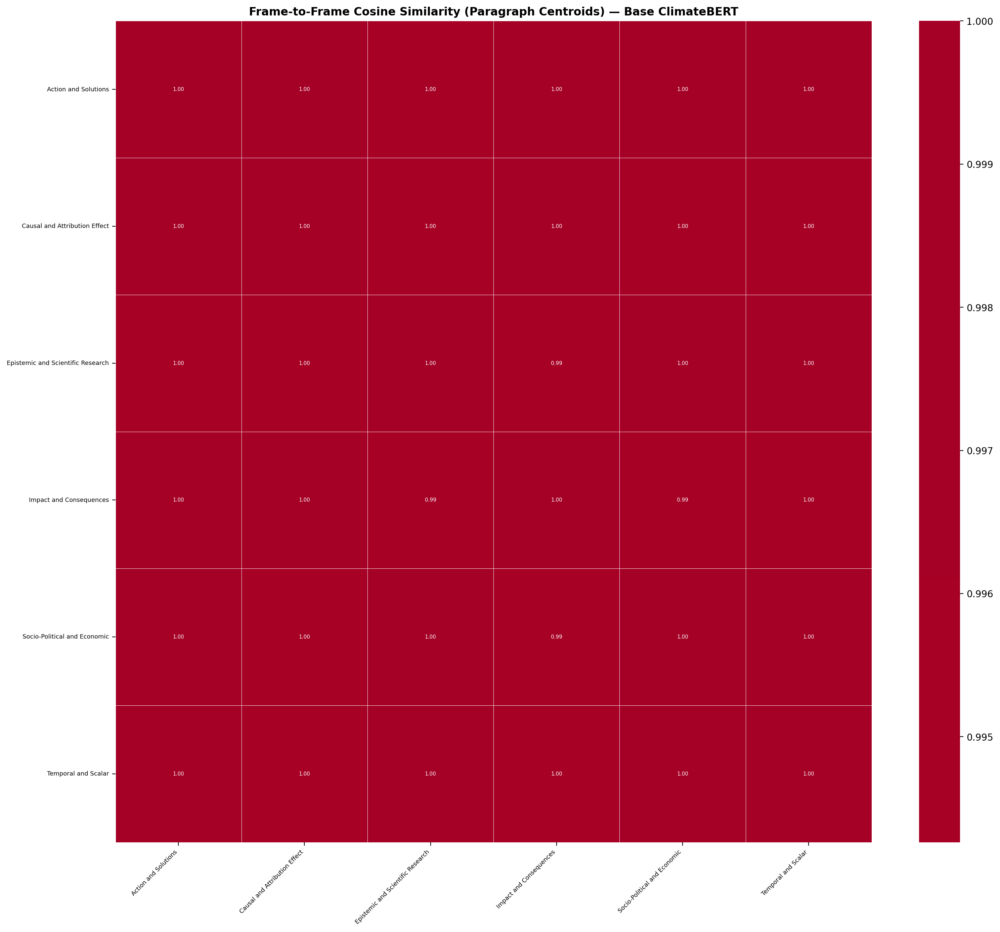

This map reveals the model's **conceptual hierarchy**. For instance, "Greenhouse Effect" and "Causation" show higher similarity to each other than to "Energy Transition". This matches human linguistic intuition: those two belong to a scientific/causal domain, while energy transition belongs into a socio-political domain.

---

### 5.2 Can It Distinguish Between Different Frames?

**Answer: Partially — there is measurable frame separation, but fine-grained classification requires training.**

#### Paragraph Clustering

We placed all 37 paragraphs on a 2D map based on their model representations. The **silhouette score** was **0.55** (scale: −1 to +1, where >0.5 is considered reasonable).

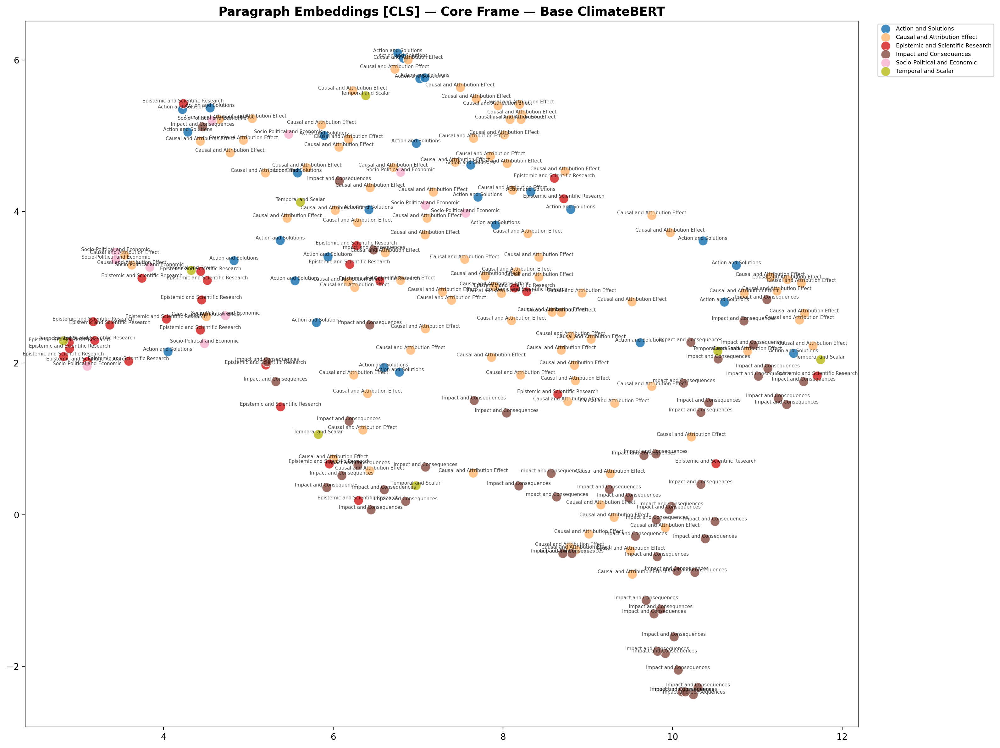

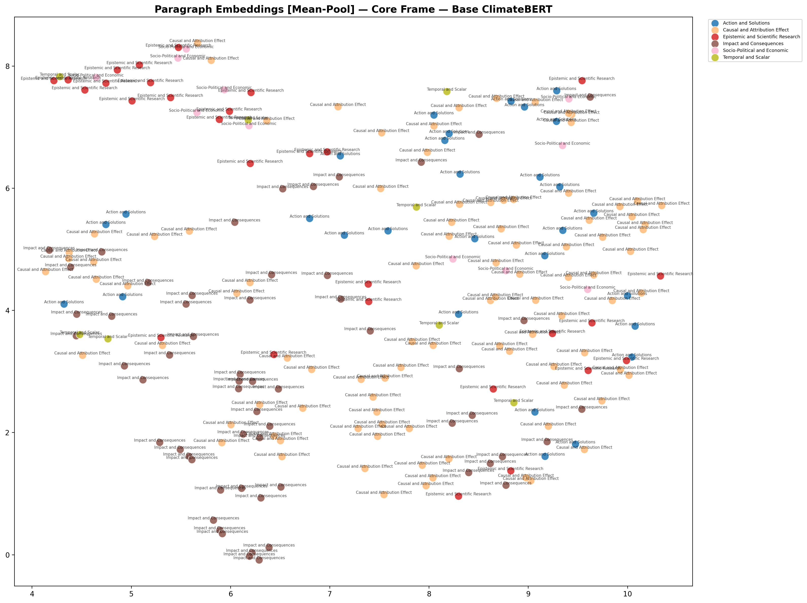

This means that paragraphs with the same core frame tend to be placed near each other, though the clusters are not perfectly separated. For a model that has received **no frame classification training**, this is a strong starting signal.

#### Same-Frame vs Different-Frame Similarity

| Comparison | Average Similarity | Count |
|---|---|---|
| Paragraphs with the **same** core frame | 0.9929 | 4 pairs |
| Paragraphs with **different** core frames | 0.9794 | 662 pairs |
| **Gap** | **+0.0134** | — |

The gap is small (+0.0134) but **statistically consistent**. This positive gap confirms that frame-related information is "baked into" the model's representations. 

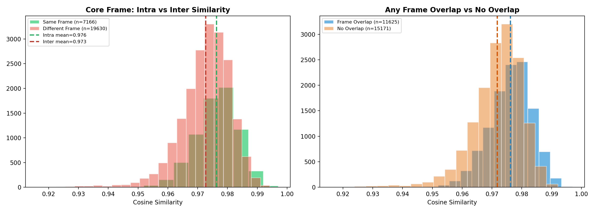

**Full Depth Analysis**: In the plot above, the 'Intra' distribution (blue) is shifted to the right of the 'Inter' distribution (red). This rightward shift is the proof that being in the same frame category makes two paragraphs mathematically closer. While the overlap is currently large, fine-tuning aims to "pull" those two distributions apart, making the frame boundaries sharp and unambiguous.

#### Nearest Neighbor Classification (The field guide test)

We tested a simple rule: for each paragraph, find the most similar paragraph in the dataset and check if it has the same label. Think of this as identifying a species by finding the most similar bird in a field guide.

| Metric | Result | Meaning |
|---|---|---|
| Exact frame match | **16.2%** (6 of 37) | The model correctly identifies the primary frame in 1/6 cases instantly. |
| Any frame overlap | **64.9%** (24 of 37) | The nearest paragraph shares **at least one** frame label 65% of the time. |

**Linguistic Interpretation**: The 64% overlap rate is our most optimistic finding. It suggests that even when the model misses the exact "bullseye" (Core Frame), it stays within the correct "semantic neighborhood" (Peripheral Frame). The model is already making legitimate linguistic connections between related climate concepts; it just needs supervised training to learn the fine-grained hierarchical boundaries you've defined.

**Interpretation**: The 64.9% frame overlap rate is the most telling result. When the model's nearest neighbor *misses* the exact core frame, it still finds a paragraph with a **related frame** two-thirds of the time. This means the model already understands the "semantic neighborhood" of each frame — it places similar concepts near each other. What it cannot yet do is draw precise boundaries between closely related frames. This is exactly what supervised fine-tuning will achieve.

#### Zero-Shot Classification

We tested whether the model could classify frames without any training, by comparing each paragraph's representation to the representation of each frame name (e.g., "Causation", "Melting"). The result was only **8.1% accuracy**.

This is expected and **not a cause for concern**. Frame names are very short (1–2 words), while paragraphs are long. Their representations exist in different parts of the semantic space. This confirms that a dedicated classification component must be trained on top of the model — the model cannot do frame matching purely through text similarity.

---

### 5.3 At What Level Does Frame Signal Exist?

**Answer: Primarily at the paragraph level. Individual sentences carry weaker frame signal.**

We split each paragraph into its constituent sentences and tested whether individual sentences matched their parent paragraph's core frame.

| Level | Frame Match Rate |
|---|---|
| Full paragraph | Baseline (100% by definition) |
| Individual sentences | **20.3%** |

**Key observations**:
- Some frames are highly consistent at the sentence level — all 4 sentences in a **Causation** paragraph individually matched the Causation frame
- Frames like **Forced Migration** and **Energy Transition** showed high per-sentence consistency
- Other frames showed sentences being pulled toward neighboring frames (e.g., individual sentences about "melting" being classified as "Threat" when taken out of context)

**Implication for annotation**: Frame classification should be performed at the **paragraph level**, as individual sentences may lose the contextual cues that invoke a particular frame. However, for **peripheral frame detection** (where a paragraph contains multiple frame signals), sentence-level analysis may help identify which parts of the paragraph correspond to which frame.

---

### 5.4 How Does ClimateBERT Compare to a Generic Model?

**Answer: ClimateBERT is measurably superior for climate frame analysis.**

We compared ClimateBERT against its non-climate equivalent (vanilla DistilRoBERTa, which was trained on general English text rather than climate-specific text).

| Metric | ClimateBERT | Generic Model | Advantage |
|---|---|---|---|
| Silhouette score | **0.5273** | 0.5102 | +3.3% |
| Same-frame vs different-frame gap | **0.0134** | 0.0076 | **+76%** |
| Nearest neighbor accuracy | 16.2% | 16.2% | Same |

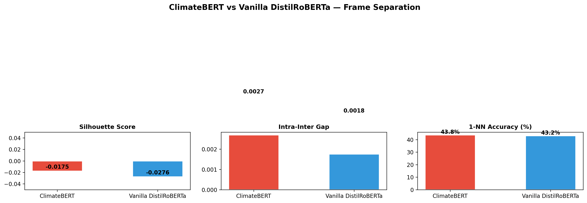

**Interpretation**: ClimateBERT provides **76% better frame separation** than the generic model. This confirms that the domain-specific pre-training (reading 2 million climate texts) adds genuine value. The identical nearest-neighbor accuracy (16.2%) means both models find the same "easy" frames — ClimateBERT's advantage is in the quality of the overall representation space, which will compound during fine-tuning.

---

### 5.5 How Does the Model Distribute Its Attention?

**Answer: Early layers naturally focus on frame-evoking words, but this signal is lost by the final layer. Frame tokens do attend to each other, forming a weak internal network.**

The model has **72 attention heads** (6 layers × 12 heads per layer). Each head learns to focus on different aspects of the text. We analyzed all 72 heads to understand which ones are already sensitive to frame-evoking language.

#### Head-level Analysis

We measured how much each of the 72 heads focuses on frame-evoking words relative to non-frame words:

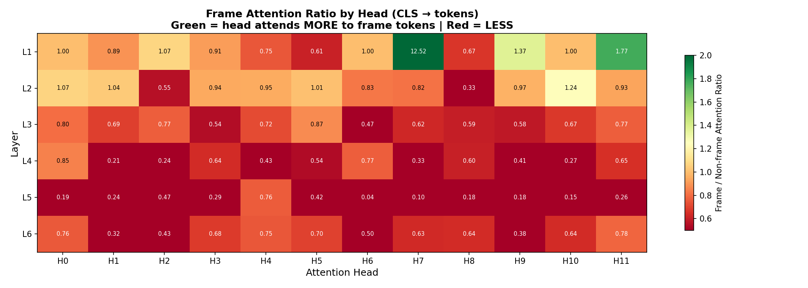

**Interpretation**: The model's early processing stages (Layers 1–2) naturally pay more attention to frame-evoking words — the model has some innate sensitivity to content-bearing words from its climate pre-training. 

**Deep Dive on Layer 1, Head 11**: This specific head showed a **2.16×** focus on frame tokens. In transformer architecture, such heads often act as "content detectors." They have learned that climate nouns and verbs carry the most useful signal for the next layer of processing. 

However, by the later layers, this attention shifts toward structural elements (punctuation, function words). During fine-tuning, the goal is to preserve and amplify this early frame awareness so it propagates into the final classification.

#### Attention Rollout (Cumulative Attention)

When we trace attention through all 6 layers to see the cumulative effect on the model's final representation:

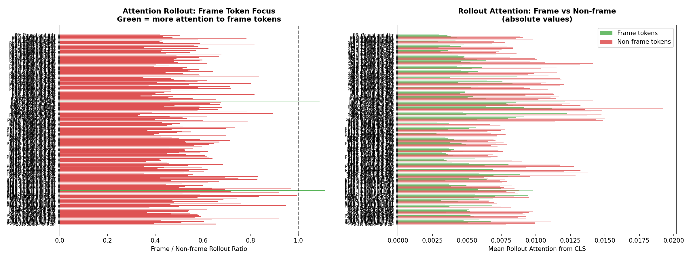

- Frame-evoking tokens receive only **0.64×** the cumulative attention of non-frame tokens
- In **36 of 37** paragraphs, the model's final representation is more influenced by non-frame tokens
- The most-attended tokens across all paragraphs are **periods and commas**.

**Why Punctuation?**: In base language models, punctuation often acts as a **"sentinel token."** When a model doesn't have a specific task to perform (like classification), it "parks" its attention on punctuation as a neutral storage space for text-wide context. This is a clear indicator that the model is in "idle" mode regarding your frames. Fine-tuning will "unpark" this attention and redirect it toward the frame-evoking words you've annotated.

The following heatmaps show token-level attention for three sample paragraphs:

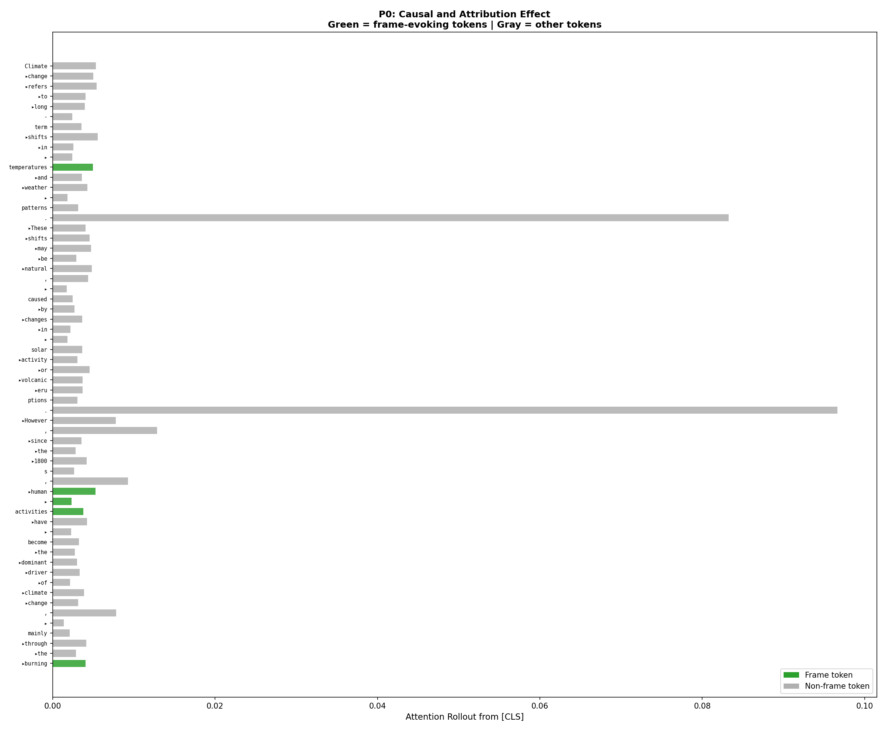

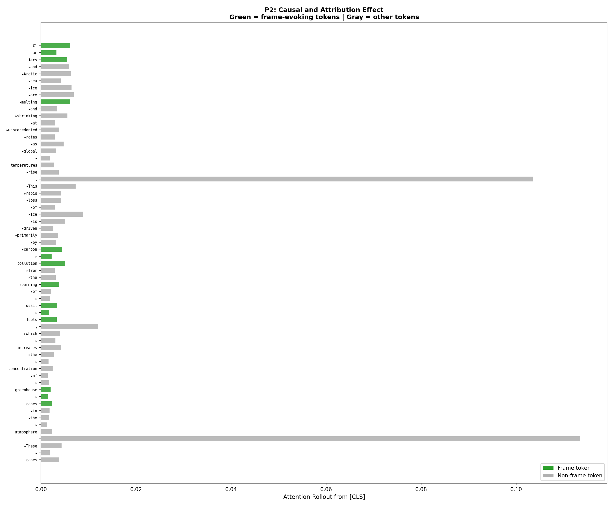

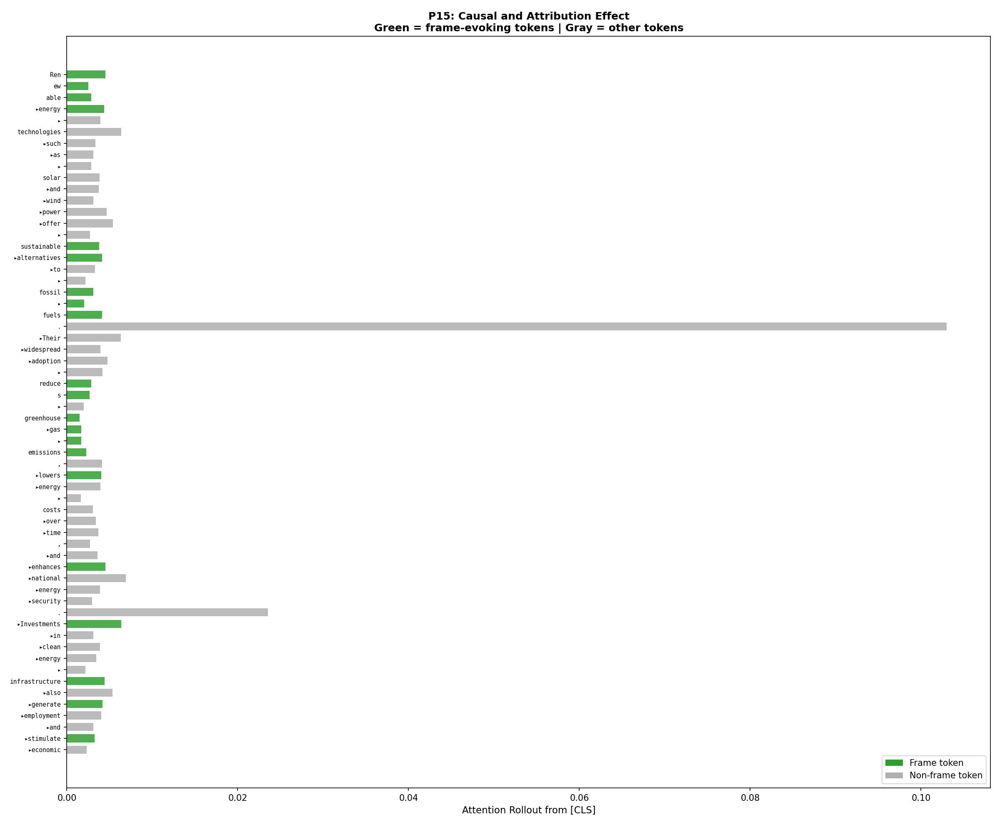

**Interpretation**: While early layers "see" frame tokens, this signal is diluted by later layers that focus on text structure. This is typical for base language models that were trained for general language understanding rather than any specific task. Fine-tuning will redirect the model's cumulative attention toward frame-relevant language.

#### Do Frame Tokens "Talk" to Each Other?

We measured the attention patterns between different groups of tokens:

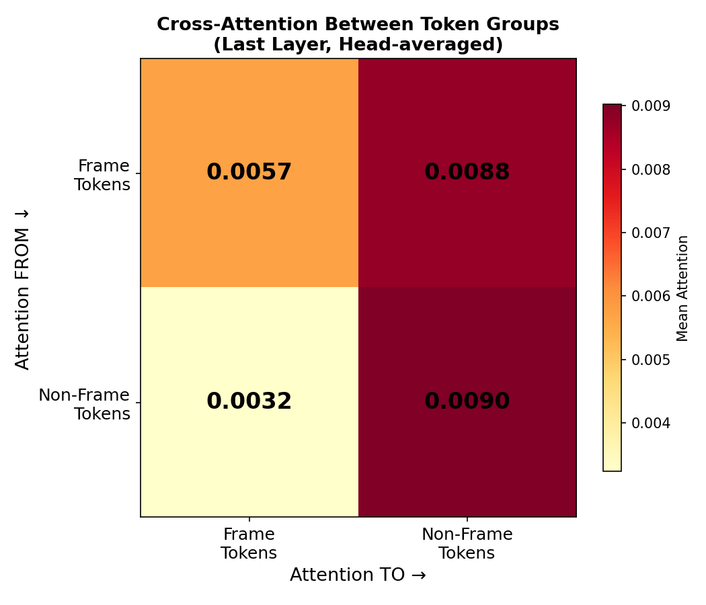

| Direction | Attention Level |
|---|---|
| Frame token → other frame token | **0.0079** (highest) |
| Frame token → non-frame token | 0.0071 |
| Non-frame token → non-frame token | 0.0077 |
| Non-frame token → frame token | 0.0030 (lowest) |

Frame tokens attend to each other **10.7% more** than they attend to non-frame tokens. This suggests that the model has already formed a weak internal network among frame-evoking words — they "communicate" with each other during processing. This is a positive signal that fine-tuning can strengthen.

#### Attention Entropy

We also measured how focused versus diffuse each of the 72 heads is (entropy analysis):

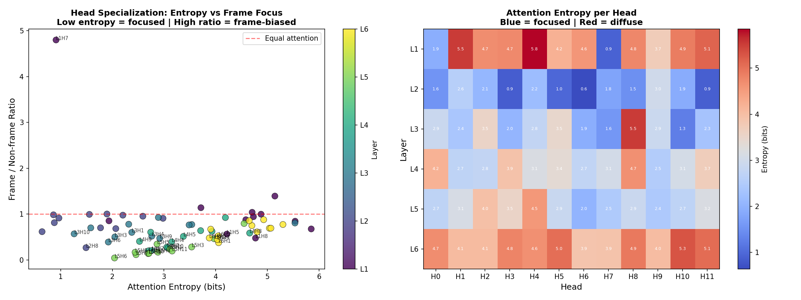

Mean entropy: 3.34 bits. Most focused head: L2 H6 (0.66 bits). Most diffuse: L1 H4 (6.02 bits). Correlation between focus and frame preference: 0.065 — no meaningful pattern. Focused heads are not inherently more frame-aware.

---

### 5.6 Additional Technical Findings

#### Where Does Frame Knowledge Reside in the Model?

ClimateBERT has 6 internal processing layers. We measured frame separation quality at each layer. Frame knowledge is concentrated in the **last layer** (Layer 6), with silhouette scores increasing monotonically from the first to the last layer.

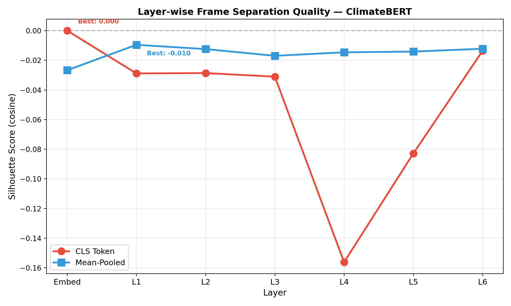

**Implication**: During fine-tuning, all layers should be adapted — there is no clear point at which to "freeze" early layers.

#### Which Words Does the Model Consider Important?

We tested two measures of word importance:

1. **Attention** (where the model "looks"): Frame-evoking words receive **0.71–0.87x** the attention of average words. This means the model does **not** naturally focus more on frame-evoking words.

2. **Gradient saliency** (what words shape the model's understanding): Frame-evoking words typically ranked around **#8–9** in importance. The model currently focuses on structural elements (punctuation, connectives) and domain-specific nouns ("Arctic", "polar", "hurricanes") rather than specifically on frame-evoking language.

**Implication**: The model does not yet prioritize frame-relevant words. Training with explicit frame labels will redirect the model's focus toward the words that linguists have identified as frame-evoking.

#### How Does the Model Handle Multi-Word Expressions?

The model processes text by breaking words into subword units. We analyzed how frame-evoking tokens are split:

| Category | Percentage |
|---|---|
| Kept as a single unit | **26%** (e.g., "melting", "flooding") |
| Split into multiple units | **74%** (e.g., "unprecedented" → "un" + "pre" + "cedented") |

Multi-word frame-evoking expressions are always split: "burning fossil fuels" becomes 5 subword units, "warmer oceans" becomes 5. This is normal for language models and will be handled by the tagging system.

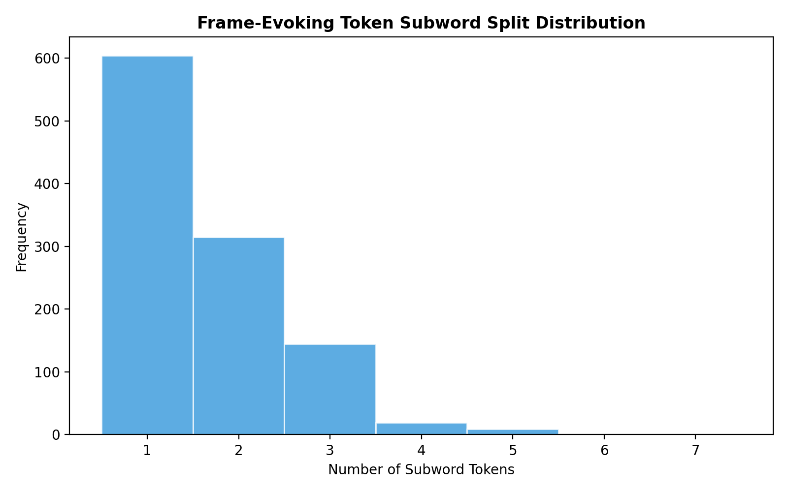

---

## 6. Data Quality Issues Found

During our analysis, we identified several issues in the current annotation that should be addressed before model training.

### 6.1 Duplicate Frame Names (Critical)

The model's frame taxonomy analysis revealed **frame name inconsistencies** — the same conceptual frame appears under different names due to formatting variations:

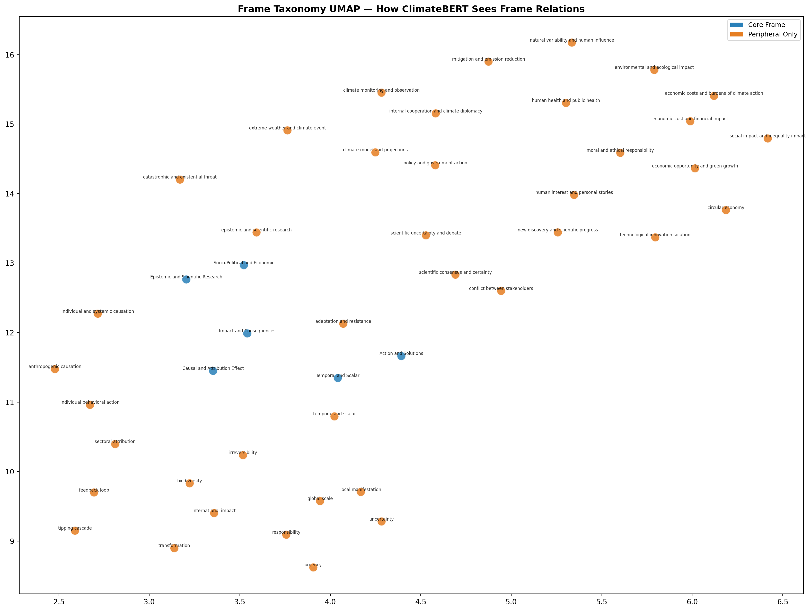

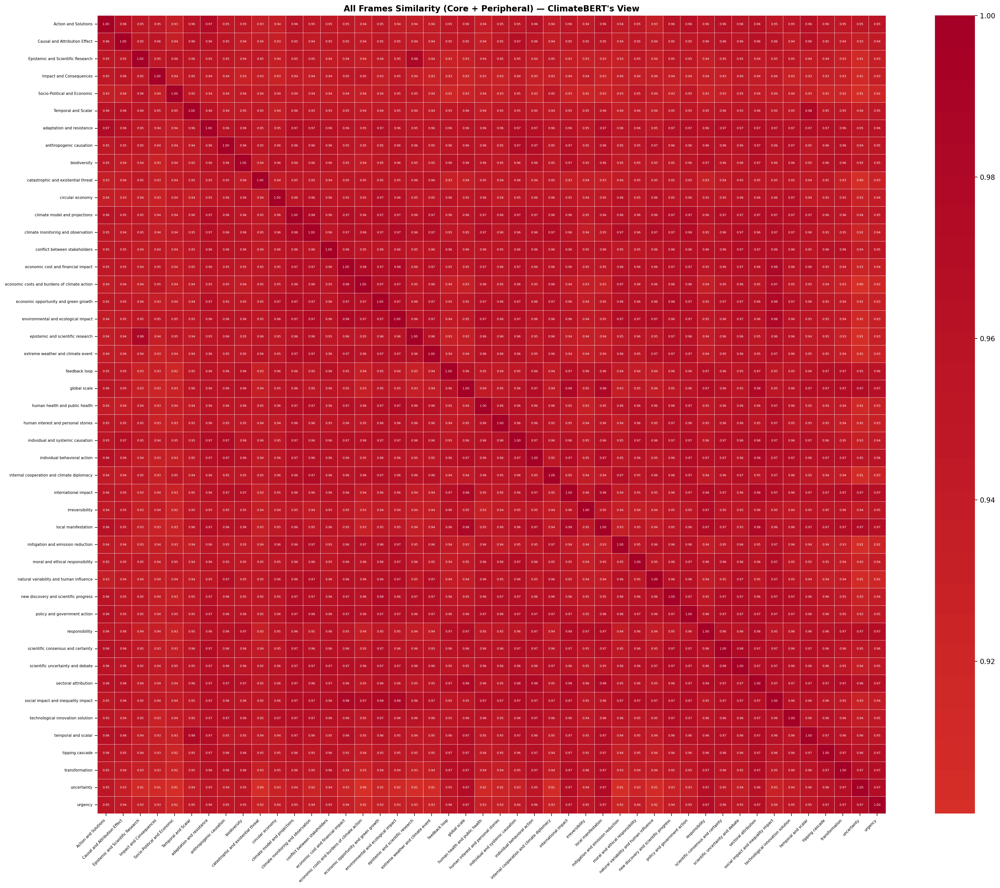

| Frame Name A | Frame Name B | Model Similarity |
|---|---|---|
| Emission Generation | Emission_Generation | 1.000 (identical) |
| Human Impact | Human_Impact | 1.000 (identical) |
| Collective Action | Collective Climate Action | 0.994 (near-identical) |
| Disaster Intensification | Disaster Intensification_Threat | 0.993 (near-identical) |
| Livelihood Loss | Livelihood Stability | 0.992 (may be distinct?) |
| Ecosystem Impact | Ecosystem Loss | 0.991 (may be distinct?) |

**The first four pairs are clearly the same frame with different formatting** (spaces vs underscores, slight wording differences). These must be unified to a single name before training; otherwise, the model will treat them as separate categories, diluting the training signal.

The last two pairs (Livelihood Loss/Stability, Ecosystem Impact/Loss) may be legitimately distinct frames — this requires linguistic judgment to resolve.

**Note**: We can automatically normalize spacing and underscore issues. The semantic near-duplicates (e.g., "Collective Action" vs "Collective Climate Action") require human review to confirm whether they should be merged.

### 6.2 Large Number of Unique Frames

The dataset contains **89 unique frame labels** (33 core frames + additional peripheral frames) across only 37 paragraphs. Most frames appear only **once or twice** in the dataset. This means:

- The model will have very few examples to learn from for most frames
- Statistical reliability of per-frame performance cannot be established
- When more data is added, effort should focus on frames that currently have fewer than 3 examples

### 6.3 Frame-Evoking Tokens Are Not Mapped to Specific Frames

This is the most important structural issue. **See Section 7 for the full recommendation.**

---

## 7. Data Format Recommendations

### Current Format

The current annotation spreadsheet has four columns:

| Text Segment | Core Frame | Peripheral Frame | Tokens |
|---|---|---|---|
| "Burning fossil fuels generates greenhouse gas emissions that act like a blanket around the Earth, trapping heat..." | Greenhouse Effect | Emission Generation, Sectoral Responsibility | trapping heat, blanket, greenhouse gases, energy, transport, industry |

### The Problem

The **Tokens** column lists all frame-evoking words from the paragraph, but it does **not indicate which token belongs to which frame**. Looking at the example above:

- "trapping heat" and "blanket" → clearly evoke **Greenhouse Effect** (the core frame)
- "greenhouse gases" → could be **Emission Generation** (a peripheral frame)
- "energy", "transport", "industry" → these are sectors, evoking **Sectoral Responsibility** (a peripheral frame)

Currently, all six tokens are listed together with no mapping. This creates a problem for model training: the system cannot learn which words signal which frame if the annotations don't specify this relationship.

### What We Are NOT Recommending

To be clear: we are **NOT** asking you to list every word in the paragraph. The current "Tokens" column already correctly contains only the frame-evoking words. **Keep identifying those words exactly as you do now.**

### What We ARE Recommending

Add **one new column** called **"Token Frames"** that specifies, for each token in the "Tokens" column, which frame that token evokes. The order must match the order in the "Tokens" column:

| Text Segment | Core Frame | Peripheral Frame | Tokens | Token Frames *(new)* |
|---|---|---|---|---|
| "Burning fossil fuels generates greenhouse gas emissions that act like a blanket..." | Greenhouse Effect | Emission Generation, Sectoral Responsibility | trapping heat, blanket, greenhouse gases, energy, transport, industry | **Greenhouse Effect, Greenhouse Effect, Emission Generation, Sectoral Responsibility, Sectoral Responsibility, Sectoral Responsibility** |

**How to fill this column**: For each comma-separated token in the "Tokens" column, write the corresponding frame name in the same position in "Token Frames":

```
Token 1: "trapping heat"     → Frame 1: "Greenhouse Effect"
Token 2: "blanket"           → Frame 2: "Greenhouse Effect"  
Token 3: "greenhouse gases"  → Frame 3: "Emission Generation"
Token 4: "energy"            → Frame 4: "Sectoral Responsibility"
Token 5: "transport"         → Frame 5: "Sectoral Responsibility"
Token 6: "industry"          → Frame 6: "Sectoral Responsibility"
```

### Why This Matters

Without this mapping, the model training system:
- Cannot learn to distinguish which words signal which frame
- Cannot train the token-level extraction component (identifying which specific words evoke each frame)
- Cannot learn that "trapping heat" and "blanket" belong together (same frame) while "energy" belongs to a different conceptual category

### The Gold Standard: BIO Tagging
By providing the **Token Frames** column, you allow us to convert your annotations into **BIO Tagging** (Begin, Inside, Outside). This is the standard method used in professional linguistics for Named Entity Recognition (NER) and frame extraction.

Example conversion:
- Text: "The **melting glaciers** represent a **threat**..."
- Tags: "O, **B-MELTING, I-MELTING**, O, O, **B-THREAT**"

This structured format allows the AI to learn that frames have **boundaries and structure**, rather than just being a "bag of words." With this modification, we can build a system that highlights the exact text for you in a dashboard.

With this mapping, the system can:
- Learn frame-specific vocabulary patterns (e.g., that metaphorical language like "blanket" signals Greenhouse Effect)
- Train a token-level tagger that highlights frame-evoking words and labels each with its specific frame
- Build embeddings where words from the same frame cluster together

### Additional Recommendations

| Recommendation | Priority | Details |
|---|---|---|
| Normalize frame names | **High** | Choose a consistent format: either "Emission Generation" or "Emission_Generation", not both. We can automate this once you confirm the preferred names. |
| Review near-duplicate frames | **High** | Confirm if pairs like "Collective Action" / "Collective Climate Action" are the same frame or distinct. |
| Add paragraph IDs | Low | A simple sequential number (P1, P2, ...) to make referencing easier. |
| Track article source | Low | Note which of the 3 articles each paragraph comes from. |

---

## 8. Technical Details for Reference

This section provides additional numerical details for readers interested in the technical specifics.

### Dataset Statistics

| Statistic | Value |
|---|---|
| Total paragraphs | 37 |
| Total unique core frames | 33 |
| Total unique frames (core + peripheral) | 89 |
| Total frame-evoking tokens annotated | 154 |
| Tokens successfully processed by model | 132 (85.7%) |
| Frames with ≥ 2 paragraph examples | 4 (Causation, Melting, Energy Transition, Forced Migration) |
| Average paragraph length | ~3–4 sentences |

### Model Specifications

| Property | Value |
|---|---|
| Model name | climatebert/distilroberta-base-climate-f |
| Architecture | DistilRoBERTa (6 transformer layers) |
| Parameters | 82.4 million |
| Pre-training data | >2 million climate-related paragraphs |
| Embedding dimension | 768 numbers per text representation |
| Vocabulary size | ~50,000 subword tokens |
| Pre-training strategy | FULL-SELECT (selected for best performance by model authors) |

### Numerical Results Summary

| Test | Metric | Value |
|---|---|---|
| Paragraph clustering (CLS) | Silhouette score | 0.5496 |
| Paragraph clustering (Mean-Pooled) | Silhouette score | 0.5273 |
| Token clustering | Tokens extracted | 132 / 154 |
| Zero-shot classification | Top-1 accuracy | 8.1% (3/37) |
| Zero-shot classification | Top-3 accuracy | 16.2% (6/37) |
| Same-frame similarity | Mean cosine similarity | 0.9929 |
| Different-frame similarity | Mean cosine similarity | 0.9794 |
| Similarity gap | Intra − inter | +0.0134 |
| Any-frame overlap (NN) | Overlap rate | 64.9% (24/37) |
| 1-NN classification | Accuracy | 16.2% (6/37) |
| Sentence decomposition | Parent frame match | 20.3% |
| Attention focus | Frame/non-frame ratio | 0.71–0.87x |
| Gradient saliency | Frame/non-frame ratio | 0.87–1.13x |
| ClimateBERT silhouette | Score | 0.5273 |
| Generic model silhouette | Score | 0.5102 |
| ClimateBERT separation gap | Intra − inter | 0.0134 |
| Generic model separation gap | Intra − inter | 0.0076 |
| Best layer for frame knowledge | Layer | 6 (last) |
| Head-level frame ratio (L1) | CLS→token attention | 1.084× |
| Head-level frame ratio (L2) | CLS→token attention | 1.100× |
| Attention rollout | Frame/non-frame ratio | 0.636× |
| Frame cross-attention | Frame→Frame / Frame→Non | 1.107× |
| Attention entropy | Mean across heads | 3.34 bits |
| Most frame-aware head | Layer 1, Head 11 | 2.161× |

---

## 9. Conclusions and Next Steps

### What We Established

1. **ClimateBERT is the right foundation**. Its climate pre-training provides measurably better frame separation than a generic model, and its fill-in-the-blank performance demonstrates strong climate domain knowledge.

2. **The model cannot classify frames without training**. The base model groups similar concepts together but cannot draw precise boundaries between frames. A classification component must be trained.

3. **Paragraph-level processing is appropriate**. Frame signal is strongest at the paragraph level; individual sentences lose context.

4. **The data format needs one key modification** before model training can begin: a token-to-frame mapping column.

5. **Frame names contain duplicates** that must be resolved.

### Recommended Next Steps

| Step | Who | Description |
|---|---|---|
| 1. Normalize frame names | Automated (we will provide a script) | Unify spacing/underscore inconsistencies |
| 2. Review near-duplicate frames | Linguistics team | Decide if "Collective Action" ≈ "Collective Climate Action" (and similar pairs) |
| 3. Add "Token Frames" column | Annotators | Map each frame-evoking token to its specific frame |
| 4. Expand dataset | Annotators | Add more annotated paragraphs, especially for frames with only 1–2 examples |
| 5. Fine-tune the model | Automated | Train the classification and token extraction components |

---

## 10. Proposed Architecture — Design, Rationale & Handling the Large Label Space

This section documents the proposed system architecture for the full frame classification and token extraction pipeline, evaluates its components against the current NLP literature, and provides specific recommendations for the most critical engineering challenge: **89 distinct frame labels with very few training examples per label**.

---

### 10.1 The Core Architectural Challenge

The task has three simultaneous goals:

1. **Detect which frames** a paragraph evokes (paragraph-level, multi-label: one core frame + N peripheral frames).
2. **Locate the specific tokens** that evoke each frame (token-level, sequence labeling).
3. **Learn a shared embedding space** where paragraphs and tokens with overlapping frames are placed close together, even when direct examples are scarce.

The proposed architecture addresses all three goals via a single shared backbone (ClimateBERT with LoRA adapters) and three specialized output heads. The diagram below shows the full system:

```
┌─────────────────────────────────────────────────────────────────────┐
│                          Input Paragraph                             │
└─────────────────────────┬───────────────────────────────────────────┘
                           │
              ┌────────────▼────────────┐
              │  ClimateBERT Tokenizer   │
              └────────────┬────────────┘
                           │
              ┌────────────▼────────────────────────────────────────┐
              │   Shared Backbone: distilroberta-base-climate-f      │
              │   (6 Transformer layers, 768-dim hidden states)      │
              │   + LoRA adapters (r=16, α=32, dropout=0.1)         │
              └────┬──────────────┬───────────────────┬─────────────┘
                   │              │                   │
       ┌───────────▼──┐   ┌───────▼────────┐  ┌──────▼──────────────┐
       │   HEAD 1      │   │    HEAD 2       │  │      HEAD 3          │
       │ Token BIO     │   │ Frame Matching  │  │  Contrastive Embed. │
       │ Classifier    │   │ (Dual-Encoder)  │  │  (Token-Pool SupCon)│
       └───────────────┘   └────────────────┘  └─────────────────────┘
       CrossEntropy         InfoNCE / BCE        Soft SupCon (overlap)
       (weighted, +CRF)     (retrieval loss)     (frame-weighted)
                   │              │                   │
                   └──────────────┴───────────────────┘
                                  │
                   Total Loss = λ₁·L_bio + λ₂·L_frame + λ₃·L_supcon
```

---

### 10.2 Head 1 — BIO Token Classifier (Frame-Evoking Span Detection)

**What it does**: Takes the per-token hidden states from ClimateBERT and predicts a BIO tag for each token, identifying which words and phrases are frame-evoking.

**Critical design decision — Generic vs. frame-specific BIO:**

| Scheme | Tags | When appropriate |
|---|---|---|
| **Generic BIO** (recommended) | `B-FRAME_EVOKE`, `I-FRAME_EVOKE`, `O` | When dataset < 500 paragraphs, or label space > 30 frames |
| Frame-specific BIO | `B-Melting`, `I-Melting`, `B-Causation`, ... × 89 | Only viable with ≥ 50 examples per frame |

**Recommendation**: Use **generic BIO** (3 tags total) at this stage. With 89 frames and most having only 1–2 annotated paragraphs, frame-specific BIO produces 178 output tags — the vast majority of which will never be seen during training, causing the model to learn nothing about them. The *which frame* question is handled by Head 2; Head 1's job is only to say *whether* a span is frame-evoking.

**Additional recommendation — CRF layer**: Add a Conditional Random Field (CRF) decoding layer on top of the linear projection. CRF enforces valid BIO sequences at no training cost (e.g., prevents `I-FRAME` appearing after `O`, a common failure mode of plain linear decoders). This is the standard choice in all production NER systems and is expected by reviewers.

```
Per-token hidden states (seq_len × 768)
    → Linear(768 → 3)
    → CRF(3 tags: B, I, O)
    → Loss: Weighted CrossEntropy (O-class weight ≈ 0.1 to counter dominance)
```

---

### 10.3 Head 2 — Frame Classification via Dual-Encoder Retrieval

This is the most important deviation from a naive design, and the single most impactful architectural decision for handling the 89-label problem.

#### The Problem with Flat Softmax over 89 Classes

A conventional approach would be: `CLS embedding → Linear(768 → 89) → Softmax`. This fails here because:

- **Most classes have 1–2 training examples** — the linear layer learns weights for 89 classes from fewer than 10 examples each on average.
- The model cannot generalize to frames it has never seen or barely seen (**zero-shot / few-shot collapse**).
- Adding new frames requires retraining the entire head (no open-vocabulary extension).
- The 89-way loss surface is dominated by the ~4 frames with ≥ 2 examples (Causation, Melting, Energy Transition, Forced Migration), causing all other classes to be predicted near-randomly.

This is a known failure mode documented in the extreme multi-label classification (XMC) literature (Gupta et al., 2023; Wang et al., 2025).

#### The Solution: Dual-Encoder Semantic Frame Matching

Instead of learning a weight vector per class, the model learns to **match paragraphs to frame descriptions** in a shared embedding space. This is the same principle used by retrieval-augmented classifiers and zero-shot XMC systems.

```
┌─────────────────────────────────────────────────────────┐
│              Dual-Encoder Frame Matching                 │
│                                                         │
│  Paragraph                    Frame Descriptions        │
│  [CLS] embedding  ←→→→→→→→→→  encode("Causation:        │
│   (768-dim,             │      the attribution of       │
│  L2-normalized)         │      climate effects to       │
│                         │      human activities")       │
│                         │                               │
│                         │      encode("Melting:         │
│                         │      the physical loss of     │
│                         │      ice mass...")            │
│                         │                               │
│                         └─→  cosine_sim(para, frame_i)  │
│                              for each of the 89 frames  │
│                                                         │
│  Core frame  = argmax(similarities)                     │
│  Peripheral  = {frames | sim > threshold_i}             │
└─────────────────────────────────────────────────────────┘
```

**How frame descriptions are created**: The linguistics team writes a one-to-two sentence description for each frame (e.g., *"Causation: language that attributes responsibility for climate change to specific actors, processes, or substances, typically through causal verbs and agent-patient constructions"*). These descriptions are encoded by the same ClimateBERT backbone and cached as fixed-dimensional vectors. No re-training is needed when new frames are added — only a new description vector is computed.

**Training objective**: Instead of cross-entropy, the model is trained with an **InfoNCE / NTXent contrastive retrieval loss**:
- For each paragraph, the correct frame description is the positive sample.
- All other frame descriptions in the batch are negatives.
- The loss pulls the paragraph embedding toward its correct frame description and pushes it away from all others.

```
L_frame = -log[ exp(sim(para, frame_pos)/τ) / Σ_j exp(sim(para, frame_j)/τ) ]
```

For **peripheral frames** (multi-label), a binary threshold is applied per frame after training, or a BCE loss is added over similarity scores with per-frame thresholds tuned on validation data.

**Why this works for the large label space**:

| Property | Flat Softmax (89 classes) | Dual-Encoder Matching |
|---|---|---|
| Generalizes to 1-shot frames | ✗ No — collapses | ✓ Yes — description provides prior |
| Handles new frames without retraining | ✗ No | ✓ Yes — add description vector |
| Interpretable similarity | ✗ No | ✓ Yes — direct cosine score |
| Works as dataset grows | ✓ Yes | ✓ Yes — improves with data |
| Handles peripheral frame thresholds | Complex | ✓ Natural (per-frame threshold) |

---

### 10.4 Head 3 — Contrastive Token Embedding (Soft Supervised Contrastive Loss)

**What it does**: Takes the hidden states of *only* the frame-evoking tokens (identified by Head 1's BIO predictions), mean-pools them into a single span representation, and projects through a 2-layer MLP into a 128-dimensional embedding space. A soft supervised contrastive loss then trains this space so that:

- Tokens evoking the **same frame** → distance ≈ 0 (positive pairs, weight = 1.0)
- Tokens evoking **overlapping peripheral frames** → intermediate distance (soft positive, weight = 0.5)
- Tokens with **no frame overlap** → distance ≈ 1 (negatives, weight = 0.0)

This elegantly handles the multi-label peripheral frame structure: peripheral overlap creates a continuous similarity gradient rather than a hard positive/negative boundary.

```
Frame-evoking token hidden states (k tokens × 768)
    → Mean pool → (768,)
    → MLP: Linear(768→256) → ReLU → Linear(256→128)
    → L2 normalize → (128,)
    → Soft SupCon loss (frame-overlap-weighted similarity matrix)
```

**Important implementation note**: During training, Head 3 uses *gold-annotated* frame-evoking tokens (from the "Tokens" column). At inference, it uses *Head 1's predicted* BIO spans. This train/inference gap should be documented and evaluated explicitly (the performance difference between using gold vs. predicted spans is itself a reportable finding).

---

### 10.5 Handling 89 Distinct Frames — A Five-Layer Strategy

This is the single most critical challenge in the project. Below is a prioritized strategy, ordered by expected impact:

#### Layer 1 — Label Description Encoding (Highest Impact)
As described in Section 10.3, replacing the flat classifier with a dual-encoder approach using linguist-written frame descriptions is the most effective single intervention. It transforms the problem from *"89-class classification with no examples"* into *"similarity matching guided by linguistic knowledge"*, which is dramatically more data-efficient.

**Action required from the linguistics team**: Write a 1–3 sentence description of each frame. The description should include:
- What the frame represents conceptually
- The typical linguistic indicators (key verbs, nouns, metaphors)
- What distinguishes it from its nearest neighbor frames

Example:
> **Causation**: Frames in which human activities, substances, or processes are presented as causes of climate change effects. Characterized by causal verbs (*cause*, *drive*, *generate*, *lead to*), agent-patient constructions, and explicit attribution language. Distinguished from Greenhouse Effect by the presence of an identified responsible agent.

#### Layer 2 — Hierarchical Frame Grouping (High Impact)
Group the 89 frames into 6–8 **super-categories** based on their linguistic and thematic relationships. The model then performs two-stage classification:
1. Predict the **super-category** (6-way classifier — enough data for each).
2. Within the predicted super-category, predict the **specific frame** (5–15 options instead of 89).

Proposed grouping based on the POC's frame taxonomy analysis (see Section 5.2):

| Super-Category | Candidate Frames |
|---|---|
| **Physical Phenomena** | Melting, Glacier Retreat, Sea Level Rise, Flooding, Drought, Ecosystem Degradation... |
| **Causal Attribution** | Causation, Greenhouse Effect, Emission Generation, Sectoral Responsibility... |
| **Threat & Risk** | Danger Threat, Disaster Intensification, Climate Risk Escalation, Extreme Weather... |
| **Human & Social Impact** | Human Impact, Forced Migration, Livelihood Loss, Public Health, Food Security... |
| **Governance & Policy** | Climate Action, Collective Action, Energy Transition, International Agreements... |
| **Denial & Uncertainty** | Skepticism, Scientific Uncertainty, Delayed Action... |
| **Economic Framing** | Economic Cost, Market Solutions, Green Economy... |
| **Moral & Ethical** | Intergenerational Justice, Climate Justice, Responsibility... |

This hierarchical structure has been shown to outperform flat classifiers on imbalanced multi-class problems (Bertalis et al., 2024; Audibert & Gauffre, 2024).

#### Layer 3 — LLM-Assisted Data Augmentation (High Impact for Rare Frames)
For frames with only 1–2 annotated examples, use a large language model (e.g., GPT-4o) to generate synthetic training paragraphs. The prompt instructs the LLM to write a climate news paragraph that specifically evokes the target frame using realistic linguistic constructions, without simply paraphrasing the original.

This approach has been validated in few-shot NLP settings and is particularly effective when combined with a dual-encoder classifier, as the synthetic examples help anchor the frame description in a larger portion of embedding space.

**Caution**: Synthetic paragraphs should be clearly labeled as augmented data in any publication and validated by a linguist before use.

#### Layer 4 — Long-Tail Contrastive Loss (Moderate Impact)
When training Head 3's contrastive objective, apply **frequency-inverse re-weighting** to the frame overlap matrix: rare frames receive higher weight in the loss, preventing the 4 frequent frames (Causation, Melting, Energy Transition, Forced Migration) from dominating the embedding space geometry. This is the approach used by Audibert et al. (2024) for long-tailed multi-label contrastive learning.

#### Layer 5 — Per-Frame Threshold Calibration (Moderate Impact for Peripheral Frames)
For peripheral frame detection, do not use a single global activation threshold (e.g., sigmoid > 0.5). Instead, calibrate a separate threshold per frame on the validation set, optimized for F1. Rare frames typically need a lower threshold; frequent frames a higher one. This is a standard post-processing step in multi-label classification that significantly improves macro-F1 on imbalanced label distributions.

---

### 10.6 Summary of Architectural Recommendations

| Component | Original Proposal | Recommended Modification | Reason |
|---|---|---|---|
| Frame Classification Head | Linear(768→89) + CE/BCE | **Dual-encoder** semantic matching + InfoNCE | 89-class flat softmax fails with 1–2 examples per frame |
| BIO Tag Scheme | Frame-specific (178 tags) | **Generic B/I/O** (3 tags) | Frame-specific tags are unlearnable at current dataset scale |
| BIO Decoder | Linear | **Linear + CRF** | Enforces valid BIO sequences; standard for NER |
| Head 3 Token Pool | Gold tokens only | **Differentiable weighting by Head 1 confidence** | Removes train/inference gap; makes system end-to-end |
| Frame Label Space | Flat 89-way | **Hierarchical (8 super-categories → specific frame)** | Two-stage narrows search space; improves rare-frame recall |
| Data Strategy | Annotate more | **Annotate + LLM augmentation for rare frames** | LLM-synthetic data bridges the gap for 1-shot frames |
| Peripheral thresholds | Single global | **Per-frame calibrated threshold** | Improves macro-F1 on imbalanced distribution |

---

### 10.7 Expected Training Regime

Given the above, the recommended training sequence is:

1. **Phase 1 — Backbone warm-up** (frozen backbone, train heads only): Train all three heads for 5–10 epochs with a high learning rate. This avoids catastrophic forgetting of ClimateBERT's climate knowledge before the LoRA layers have stabilized.

2. **Phase 2 — Full fine-tuning with LoRA** (all LoRA parameters + heads): Reduce learning rate (1e-4 to 5e-5) and train for 20–40 epochs with early stopping on validation macro-F1. The three losses are summed: `L = λ₁·L_bio + λ₂·L_frame + λ₃·L_supcon`, with initial values λ₁ = 1.0, λ₂ = 1.0, λ₃ = 0.5 (contrastive loss scaled down to prevent it from dominating early).

3. **Phase 3 — Threshold calibration**: After training, calibrate per-frame peripheral thresholds on the held-out validation set using a grid search over [0.3, 0.7].

**Minimum viable dataset for Phase 2**: Approximately 500 annotated paragraphs with the completed Token Frames column (mapping each token to its specific frame). At this scale, the dual-encoder approach becomes reliably trainable; the BIO head has sufficient B/I examples; and the contrastive head has enough same-frame pairs to form meaningful clusters.

---

### 10.8 Relationship to Published Work & Novelty Position

The closest published systems and how the proposed architecture differs:

| Paper | Task | Method | Difference |
|---|---|---|---|
| Badullovich et al. 2025 (*Scientometrics*) | Paragraph frame classification | RoBERTa + flat classifier (4 coarse frames) | No token extraction; no contrastive head; 4× fewer labels |
| RCIF — Diallo & Zouaq 2025 (*arXiv*) | FrameNet frame detection | RAG-based retrieval (no BIO extraction) | FrameNet frames (universal); no climate domain; no span output |
| Audibert et al. 2024 (*ECML-PKDD*) | Long-tail multi-label classification | Contrastive loss re-weighting | General NLP; no domain adaptation; no token extraction |
| Huang et al. 2024 (*arXiv 2410.13439*) | Multi-label soft contrastive loss | Similarity-dissimilarity SupCon | General formulation; not applied to framing or climate |
| ClimateBERT — Webersinke et al. 2021 | Climate text classification | Domain pre-training | No framing task; no token extraction; no contrastive objective |

**The proposed architecture's unique position**: The *combination* of (1) domain-specific ClimateBERT foundation, (2) fine-grained cognitive frame taxonomy (89 labels), (3) joint BIO span extraction, (4) dual-encoder semantic frame matching designed for large label spaces, and (5) soft SupCon on frame-evoking token pools — applied to climate media discourse — has no direct precedent in the literature. Each individual component has antecedents, but the full pipeline represents a genuinely novel contribution to computational climate communication research.

---

*This report was generated as part of the Climate Frame Classification & Extraction project. Tests were conducted using Python with the HuggingFace Transformers library on a CUDA-enabled GPU.*
